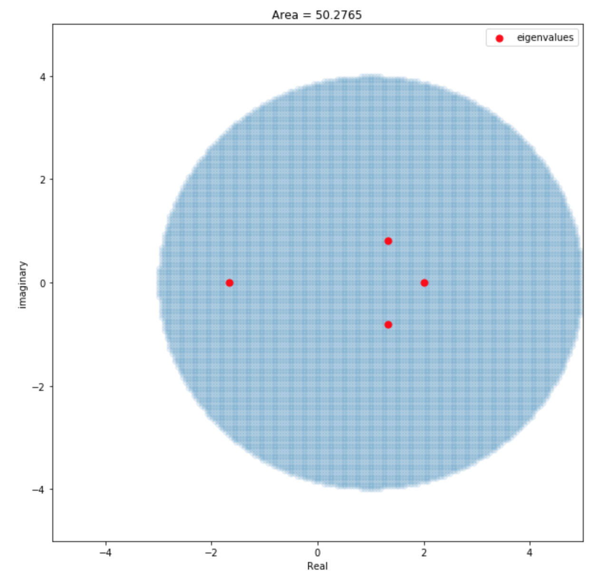
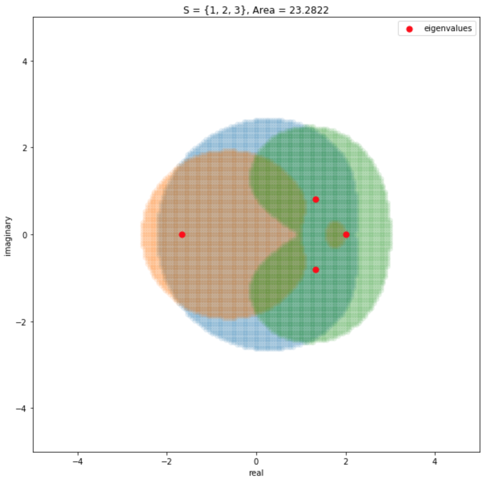
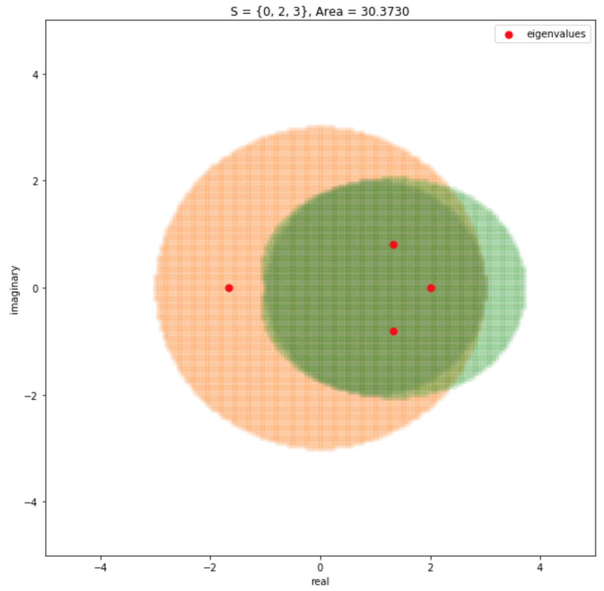

# Approximating Eigenvalues Using Isospectral Matrix Reduction and Gershgorin’s Circle Theorem

Eigenvalue solving problems has been a subject of interest in the field of numerical linear algebra for many years. It has been a large portion of our discussion in Math 510. When first approaching this problem, I recognized that it would be difficult and probably impossible to find methods that are better than the current algorithms. However, I wanted to show from this research that there are possible new and innovative ways to approach the problem. The main topic of discussion in my research is from the findings of Dr. Webb in the department of Mathematics here at BYU, so I want to thank him for his findings and contributions.

## Eigenvalue Problem

The eigenvalues and eigenvectors of a square matrix can be used to completely describe the characteristics of a matrix operation. The applications of eigenvalues are so many that it would be difficult to name all of them, but some of them include systems of linear algebraic equations, systems of linear differential equations, machine learning and statistics, facial recognition, network theory, molecular orbitals, geology, and many more. Pretty much any scientific discipline will see use in obtaining eigenvalues of a matrix. 

Let $A \in \mathbb{C}^{n \times n}$. The eigenvalue $\lambda \in \mathbb{C}$ and the corresponding eigenvector $x \in \mathbb{C}^n$ is characterised by the equation:

$$
Ax = \lambda x
$$

In other words, the eigenvalue of a matrix is a value that acts as a scalar multiplication of its corresponding eigenvector when operated by the matrix. For and $n$ by $n$ matrix, there are $n$ such eigenvalues, counting multiplicities. Rearranging the above equation, we have:

$$
Ax - \lambda x = 0 \\
\implies (A - \lambda I) x = 0 \\
\implies \text{det}(A - \lambda I) = 0
$$

The determinant of $A - \lambda I$ is called the characteristic polynomial of the matrix $A$. For an $n$ by $n$ matrix A, its characteristic polynomial is of order $n$, hence solving for the eigenvalues of A is equivalent to solving for the roots of its $n^{th}$ degree characteristic polynomial. However, as shown in the Abel-Ruffini theorem, there are no analytic solutions to finding the the roots of polynomials of degree 5 or higher, which also means that there are no analytic solutions of the eigenvalue problem when the dimension of the matrix is greater than 5. This presents a concern since matrices that are encountered in applications tend to be very large, certainly larger than 5 by 5. For this reason, there have been many iterative methods that have been developed to solve the eigenvalue problem. Among the many iterative schemes to find the eigenvalues, some of the approaches include the Power Iteration, which only finds the dominant eigenvalue eigenvector pair, the QR algorithm, which solves all the eigenvalues and eigenvectors of a Hessenberg matrix, Bisection method which applies only to real, symmetric, and tridiagonal matrices, Jacobi algorithm which applies to real and symmetric matrics, and Divide-and-Conquer method which applies to Hermitian tridiagonal matrices. The costs for these algorithms do not go above $\mathcal{O}(n^3)$.

## Isospectral Matrix Reduction

Is it possible to reduce the dimensionality of a matrix while maintaining its linear operational properties? In the context of Network theory, is it possible to remove a node from a directed graph while maintaining the same structure? This is a question that was answered by Dr. Ben Webb when he discovered Isospectral Matrix Reduction. At first glance, this seems like a trivial problem with the answer being "no" since a smaller matrix cannot have the same number of eigenvalues as a larger one simply by the definition of eigenvalues as discussed above. 

However it turns out this is actually possible if we don't limit the entries of the matrix to be in the field of $\mathbb{C}$. Let $\mathbb{W}$ be the set of all rational functions of variable $\lambda$ (the same $\lambda$ we use for finding eigenvalues) and coefficients in $\mathbb{C}$ in reduced form, i.e. $P(\lambda) / Q(\lambda) \in \mathbb{W}$ where $P$ and $Q$ are polynomials. Then, a matrix $M \in \mathbb{W}^{m \times m}$ can have more eigenvalues than its dimension, depending on its rational function entries.

For $M \in \mathbb{W}^{m \times m}$, let $`R, C \subset \{1, 2, ... , m\}`$ be the index set such that $M_{RC}$ is the submatrix of the matrix $M$ comprised of $R$ rows and $C$ columns. For example, let matrix $M$ be given as:

$$
M =
\begin{bmatrix}
1 & 0 & 1 & -1\\
2 & 1 & -1 & 1\\
1 & 0 & 0 & 2\\
1 & 1 & 1 & 1\\
\end{bmatrix}
$$

and let $`R = \{1, 4\}`$ and $`C = \{2, 3\}`$. Then the submatrix $M_{RC}$ is given by:

$$
M_{RC} =
\begin{bmatrix}
0 & 1\\
1 & 1\\
\end{bmatrix}
$$

Now, let $\overline{R}$ be the set complement of $R$, $`\overline{R} = \{1, 2,...,m\} \setminus R`$ and same for $\overline{C}$, so that $`\overline{R} = \{2, 3\}`$ and $`\overline{C} = \{1, 4\}`$. Then, the submatrices $M_{\overline{R}C}$, $M_{R\overline{C}}$, and $M_{\overline{R}\overline{C}}$ is given by:

$$
M_{\overline{R}C} =
\begin{bmatrix}
1 & -1\\
0 & 0\\
\end{bmatrix}
M_{R\overline{C}} =
\begin{bmatrix}
1 & -1\\
1 & 1\\
\end{bmatrix}
M_{\overline{R}\overline{C}} =
\begin{bmatrix}
2 & 1\\
1 & 2\\
\end{bmatrix}
$$

Then, given a matrix $M \in \mathbb{W}^{m\times m}$ and an index set $`S \subset \{1, 2,..., m\}`$, and its complement $\overline{S}$, the Isospectral reduction of $M$, $\mathcal{R}_s (M)$ is given by:

```math
\mathcal{R}_{S}(M) = M_{SS} - M_{S\overline{S}}(M_{\overline{SS}} - \lambda I)^{-1}M_{\overline{S}S}
```

It has been proven that the spectrum of $\mathcal{R}_S(M)$, or $\sigma(\mathcal{R}_S(M))$ is given by:

```math
\sigma(\mathcal{R}_S(M)) = \sigma(M) \setminus \sigma(M_{\overline{S}\overline{S}})
```

For example, let $M$ be the matrix given about and let $S$ be the set $`S = \{2, 3, 4\}`$. Then, the Isospectral reduction of $M$ is given by: 

```math
\sigma(\mathcal{R}_S(M)) = \sigma(M) \setminus \sigma(M_{\overline{S} \overline{S} })
```

```math
\begin{align*}
\mathcal{R}_{S}(M) &= M_{SS} - M_{S\overline{S}}(M_{\overline{SS}} - \lambda I)^{-1}M_{\overline{S}S} \\
&= 
\begin{bmatrix}
1 & -1 & 1\\
0 & 0 & 2\\
1 & 1 & 1\\
\end{bmatrix} - 
\begin{bmatrix}
1\\
1\\
2\\
\end{bmatrix} (1 - \lambda)^{-1}
\begin{bmatrix}
0 & 1 & -1\\
\end{bmatrix} \\
&= 
\begin{bmatrix}
1 & -1 - \frac{2}{1 - \lambda} & 1 + \frac{2}{1 - \lambda}\\
0 & \frac{-1}{1 - \lambda} & 2 + \frac{1}{1 - \lambda}\\
1 & 1 - \frac{1}{1 - \lambda} & 1 + \frac{1}{1 - \lambda}\\
\end{bmatrix}
\end{align*}
```

It can be verified numerically that $\sigma(\mathcal{R}_S(M)) = \sigma(M)$ although $M \in \mathbb{W}^{4 \times 4}$ and $\mathcal{R}_S(M) \in \mathbb{W}^{3 \times 3}$.

<br>
<div align="center">

  
  
  Figure 1. The Gershgorin regions of the matrix $M$, where the red points are the eigenvalues of <br> $M$. Observe that all of the eigenvalues are within the Gershgorin regions.
</div>

## Gershgorin Circle Theorem

The Gershgorin Circle Theorem was first proposed by the Soviet mathematician Semyon Aronovich Gershgorin in 1931. The proposed theorem does not give an accurate description of eigenvalues, but it does give regions in the complex plain where the eigenvalues must lie. Let $A \in \mathbb{C}^{n \times n}$ with its entries being $a_{ij}$. The Gershgorin Circle Theorem shows that the eigenvalues of the matrix $A$ must lie in the region described by:

```math
\Gamma(A) = {\Large\bigcup}_{i=1}^n {\Large\{}\lambda \in \mathbb{C} : |\lambda - A_{ii}| \leq {\Large\sum}_{j=1, j\neq i}^n |A_{ij}|{\Large\}}
```

Hence, $\sigma(A) \subset \Gamma(A)$. In other words, the eigenvalues of the matrix $A$ is contained in the discs that is described by its center at the diagonal value and its radius as the row sum of the off-diagonal values for each of the rows. For our example matrix $M$, the Gershgorin regions are then obtained as:

```math
\Gamma(M) = \{|\lambda - 1| \leq 2\} \cup \{|\lambda - 1| \leq 4\} \cup \{|\lambda| \leq 3\} \cup \{|\lambda - 1| \leq 3\}
```

and this region along with the eigenvalues of $M$ are shown in Figure \ref{fig:gersh1}. 

What is interesting about this theorem is that the theorem still holds for matrices of the set $\mathbb{W}^{n\times n}$. Also, for a matrix $M$ and the reduced matrix $\mathcal{R}_S(M)$, it is shown that the Gershgorin region of $\mathcal{R}_S(M)$ is a strict subset of the Gershgorin region of $M$, i.e. $\Gamma(\mathcal{R}_S(M)) \subset \Gamma(M)$. Therefore, we can reduce the dimensionality of the matrix and reduce the area of the Gershgorin region. The Gershgorin region of the reduced matrix in the example above is given by:

```math
\begin{align*}
\Gamma({\mathcal{R}_{S}(M)}) &= \Big\{|\lambda - 1| \leq \Big|{-1 - \frac{2}{1 - \lambda}}\Big| + \Big|1 + \frac{2}{1 - \lambda}\Big|\Big\} \\
&\bigcup \Big\{\Big|\lambda + \frac{1}{1 - \lambda}\Big| \leq \Big|2 + \frac{1}{1 - \lambda}\Big| \Big\}\\
&\bigcup \Big\{\Big|\lambda + 1 + \frac{1}{1 - \lambda}\Big| \leq 1 + \Big|1 - \frac{1}{1 - \lambda}\Big|\Big\}
\end{align*}
```

and Figure 2 shows this region in the complex plane. Observe that the area of the region of the reduced matrix (23.28) is significantly smaller than the area of the original region (50.27). However, we can also observe that the area of the Gershgorin regions, when reduced along different rows and columns, can differ significantly (30.37 when reduced along $`S=\{1, 3, 4\}`$).

<br>
<div align="center">

   
  
  Figure 2. Left: The Gershgorin regions of the matrix $M$ with $`S = \{2,3,4\}`$. <br> Right: The Gershgorin regions of the matix $M$ with $`S = \{1, 3, 4\}`$.
</div>

## Machine Learning Approach

One of the potential ways of finding a good eigenvalue estimate would be then to find the index along which the matrix would be reduced in order to minimize the resulting Gershgorin regions. This problem was approached using machine learning algorithms. The objective of the problem in high-level would then be---given a square matrix as the input, can a model produce an output that would specify the row index of which when reduced, would decrease the area of the Gershgorin region the most? 

In order to attempt this problem, a training and testing datasets were created. Each of the datapoints contained a randomly generated 8 by 8 matrix, the initial area of the Gershgorin regions, the row/column along which it would be reduced, and the area of the Gershgorin region of the reduced matrix. The matrices were generated so that the eigenvalues would be bounded within modulus of 10. 

\begin{figure}
    \centering
    \adjustimage{max size={0.3\linewidth}{1.0\paperheight}}{2_1.png}
    \adjustimage{max size={0.3\linewidth}{1.0\paperheight}}{2_2.png}
    \adjustimage{max size={0.3\linewidth}{1.0\paperheight}}{2_3.png}
    \adjustimage{max size={0.3\linewidth}{1.0\paperheight}}{2_4.png}
    \adjustimage{max size={0.3\linewidth}{1.0\paperheight}}{2_5.png}
    \adjustimage{max size={0.3\linewidth}{1.0\paperheight}}{2_6.png}
    \caption{Figure 3. The 6 different ways $M$ can be reduced to a 2 by 2 matrix and their resulting Gershgorin regions.}
    \label{fig:gersh3}
\end{figure}

I believed that a deep neural network model would be most suitable for such problem. Many different architectures of the model was tested, including linear layers, bilinear layers, and higher dimensional tensor layers. Different approaches of the criterion was also tested. One of the tested method was to let the model output 8-dimensional vector which would sum to one after passing through a soft-max activation function. The label this output was compared against was produced by finding the percentage of area decreased when the matrix was reduced along each row, then normalizing it to sum to 1. The labels would then represent a distribution of how the area would be reduced, and so Kullback-Leibler divergence was used as the cost function to minimize the difference of the output distribution and the label. 

Another approach was to simply let the model output an n-dimensional vector, where it would be compared to the row along which the area would be decreased the most. Cross-entropy function was used as the cost function in this case. Unfortunately, no matter the architecture of the model and approach in the cost function, the model struggled to learn any meaningful information about which row to reduce the matrix along with. 

I suspect that this is because the Gershgorin regions of the resulting matrix after it has been reduced along a specific row is a highly abstract information that cannot be easily obtained as a function. Machine learning was not a suitable approach in order to solve this problem after all.

## Intersection of the Regions

To reduce the Gershgorin region the most, we would want to reduce the matrix to be 2 by 2, so we would want the cardinality of our index set $S$ to be $|S| = 2$. However, there are multiple sets of $S$ we can reduce it along, and for each of the reduction, the eigenvalues of $M$ must lie in each one of the resulting Gershgorin regions. The 6 different ways our example matrix $M$ can be reduced is shown in Figure \ref{fig:gersh3}. Then, this would mean that the eigenvalues must lie in the intersection of all of these regions. This can be summarized as:
$$
\sigma(M) \subset \bigcap_{S'} \Gamma(\mathcal{R}_{S'}(M)
$$

After finding the intersection of the regions, I have found that the area of the resulting regions are significantly smaller than the area of the smallest 2 by 2 region at 1.93. This intersected region is shown in Figure \ref{fig:gersh4}. Using this region, we can then approximate the eigenvalues of the matrix.

\begin{figure}
    \centering
    \adjustimage{max size={0.6\linewidth}{1.0\paperheight}}{intersection.png}
    \caption{Figure 4. The region obtained by taking the tersection of all of the 2 by 2 reduction regions.}
    \label{fig:gersh4}
\end{figure}

### Cost Analysis

The most costly part about this comes from having to calculate the inverse of $M_{\overline{S}\overline{S}} - \lambda I$. However, since this is an update of the matrix $M_{\overline{S}\overline{S}}$, there might be a formula similar to Sherman-Woodbury-Morrison that might be able to solve this inverse quickly given the inverse of $M_{\overline{S}\overline{S}}$. Also, there are a total of $\binom{n}{2}$ possible 2 by 2 reduction of a $n$ by $n$ matrix. Then, letting the cost of the inver be $K$, the cost of the single reduction is given by $K + \mathcal{O}(n^2)$ and the cost of the all possible 2 by 2 reduction is then given by:
$$
\binom{n}{2} (K + \mathcal{O}(n^2)) = \frac{n(n-1)}{2} (K + \mathcal{O}(n^2)) = \mathcal{O}(n^4) \hspace{2mm} \text{or} \hspace{2mm} \mathcal{O}(Kn^2)
$$
Since $K \ge n^2$, this means that the cost of finding all 2 by 2 reduction is at the very list $\mathcal{O}(n^4)$ which is significantly slower than the iterative methods. Moreover, from there we then have to find the Gershgorin regions of each reduction and find the intersection of those regions. The cost of this is not cheap.

## Conclusion

In conclusion, I have shown that there are different ways in which we can locate eigenvalues of a matrix than a traditional method. Although I have demonstrated that this process is too costly and hence would not be feasible, the Isospectral reduction method might help us to develop an even faster method of solving eigenvalues than the algorithms available now. I believe that it is always worth the time and effort when exploring new ideas and concepts to solve old problems even when they are not successful, because they may be a step towards finding new ways to approach mathematical problems.

